# Coconut_Tree_Detection

**Problem Statement**:
1.	Find the no. of rows and columns of trees in the image. To justify this, you should be able to detect the lines of the rows and columns. Hence, you need to produce an intermediate output wherein you have only lines detecting those rows and columns. Also, code to count them.
2.	Find the total no. of trees in the image. Here also, you need to produce an intermediate output wherein you just have the centres of the trees. Also, a code to count them
------------------------
**Step-by-Step Solution**:

Step 1: The number of pixels (area) per tree is checked in astronomical data visualization and analysis software (SAOImageDS9) to set min to max area for contour operation.

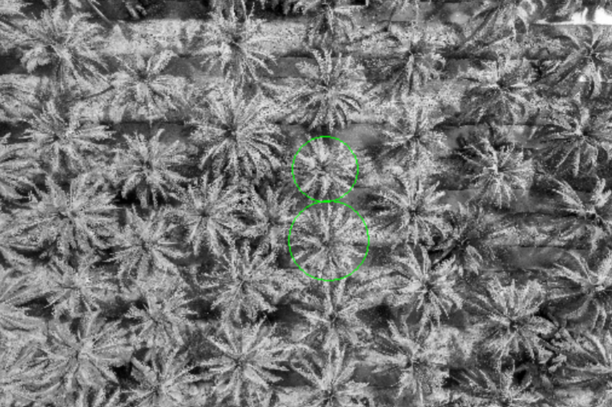

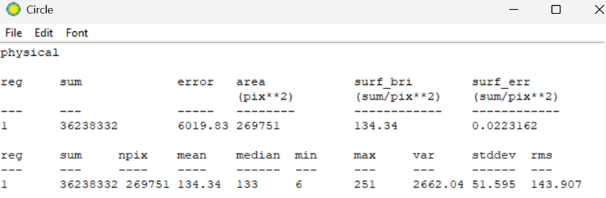

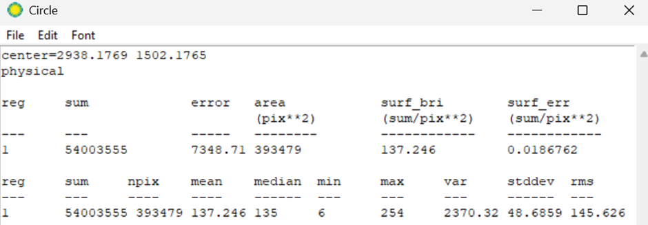

Step 2: The input image is read in two formats, such as grayscale and RGB, for data visualization and vegetation detection, respectively.

Step 3: Generate VDVI using the RGB image (If the NIR channel was present, NDVI could have been generated). This highlights vegetation pixels in the image. A threshold (V_thresh_factor) is applied to obtain a binary vegetation mask. 

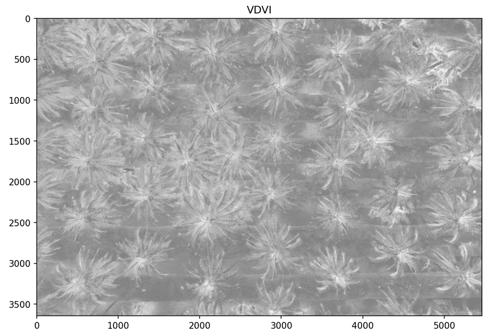

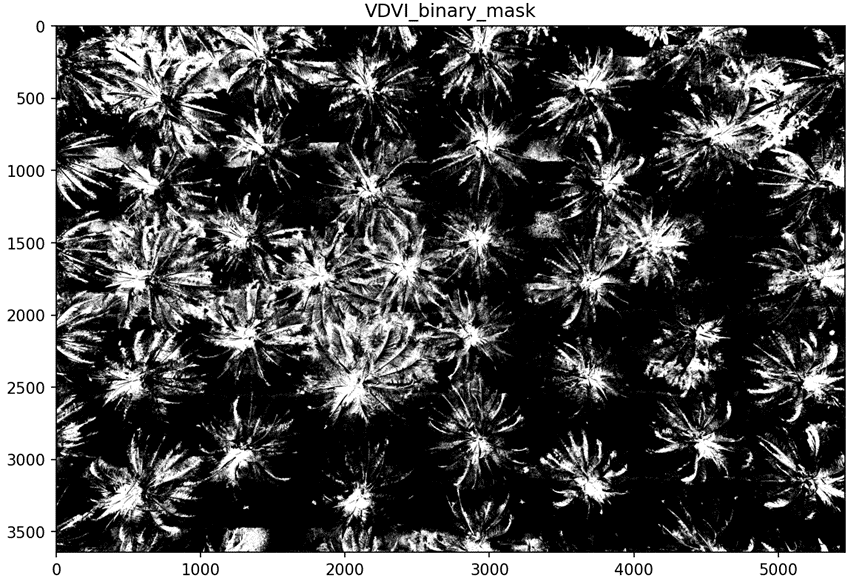

Step 4: Converted the RGB image to YCrCb color space. The Y (luminance) channel is sent to the process of Histogram equalization to enhance contrast for better object separation [1].

Step 5: The equalized Y channel is multiplied by the binary vegetation mask. This suppresses non-vegetated regions and enhances tree features.

Step 6: A small Gaussian blur is applied on the combined_Y_veg_mask from the previous step to smooth out noise before thresholding.

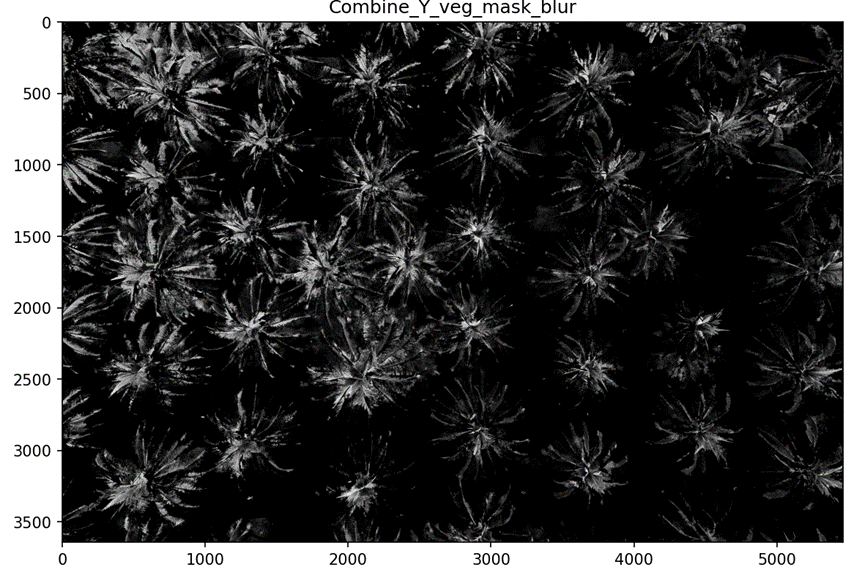

Step 7: Converted the blurred image into a binary mask to isolate individual tree canopies.

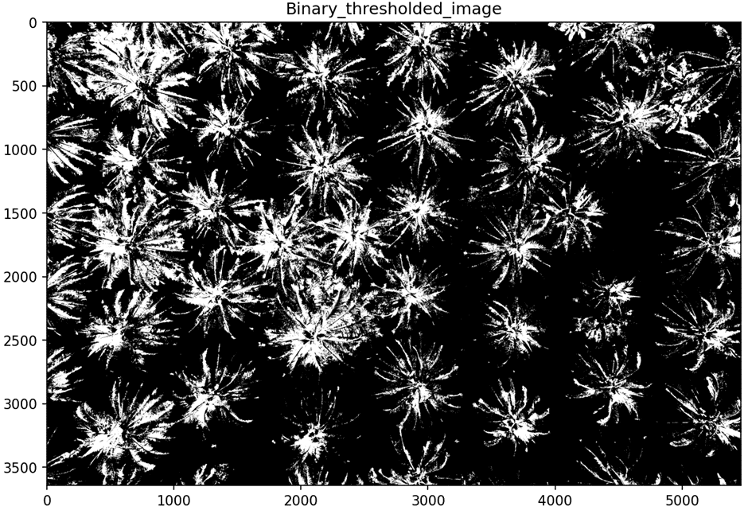

Step 8: Extracted contours from the binary image. Compute the bounding box and centroids of coconut trees by assigning min_area and max_area from the visual inspection.

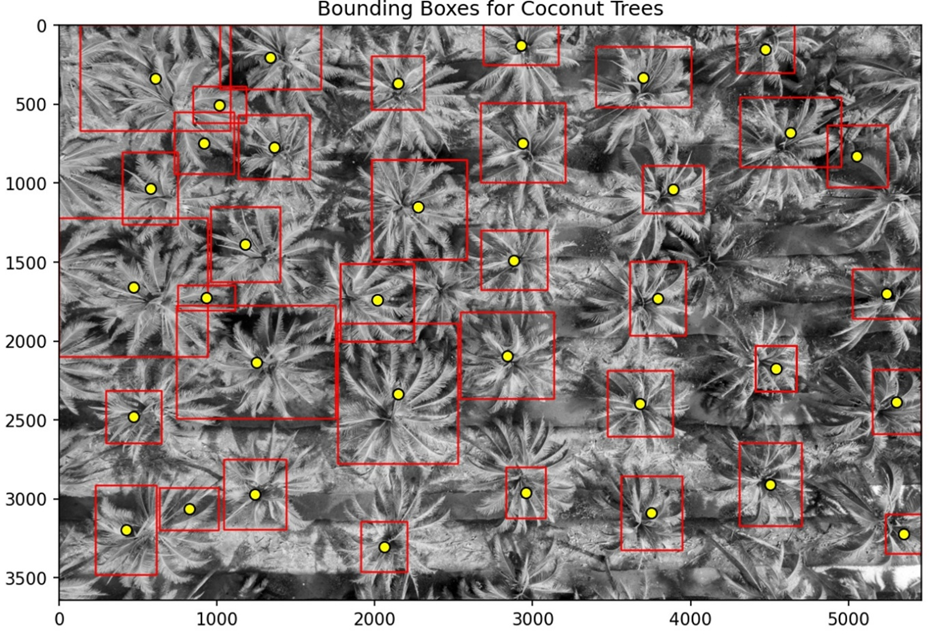

Step 9: Once the centroid_x and centroid_y are extracted, the same are clustered using a tolerance value to estimate horizontal row lines and vertical column lines. These lines may represent the plantation layout based on the plot visualization. 

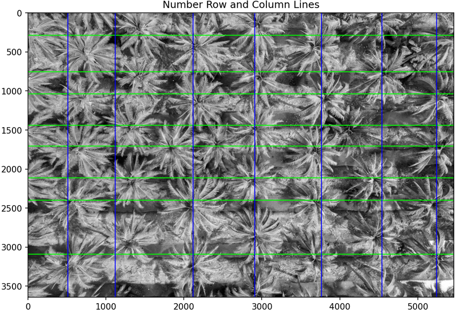

Step 8 (Another approach): Morphological Operations (Open and Close) are implemented to fill the gaps and unify broken canopies. After this, the same contour detection and feature extraction was followed on top of this Morphed image. 
Note: This procedure helped to extract trees from the edges.

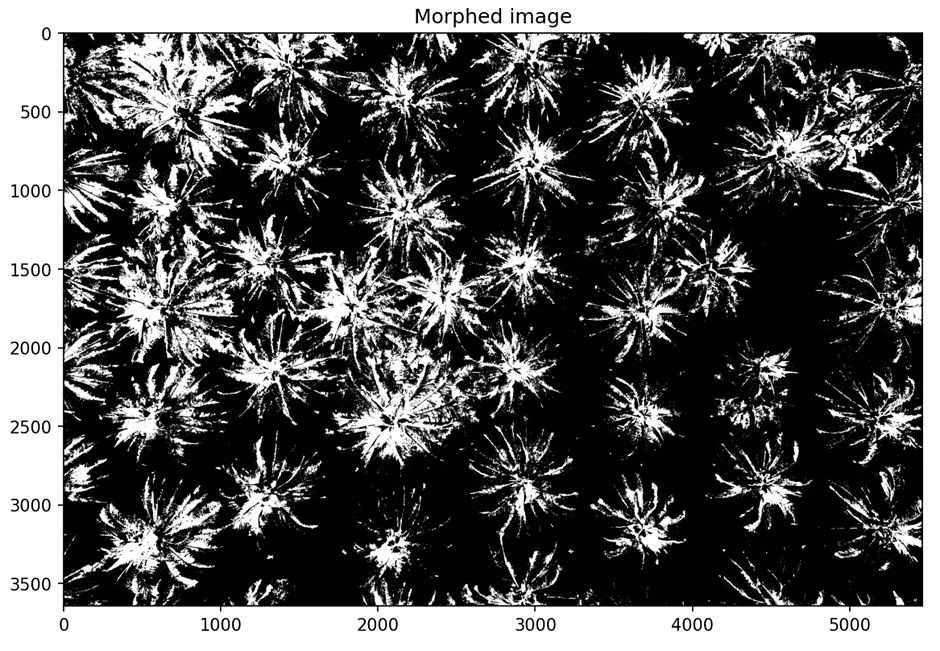

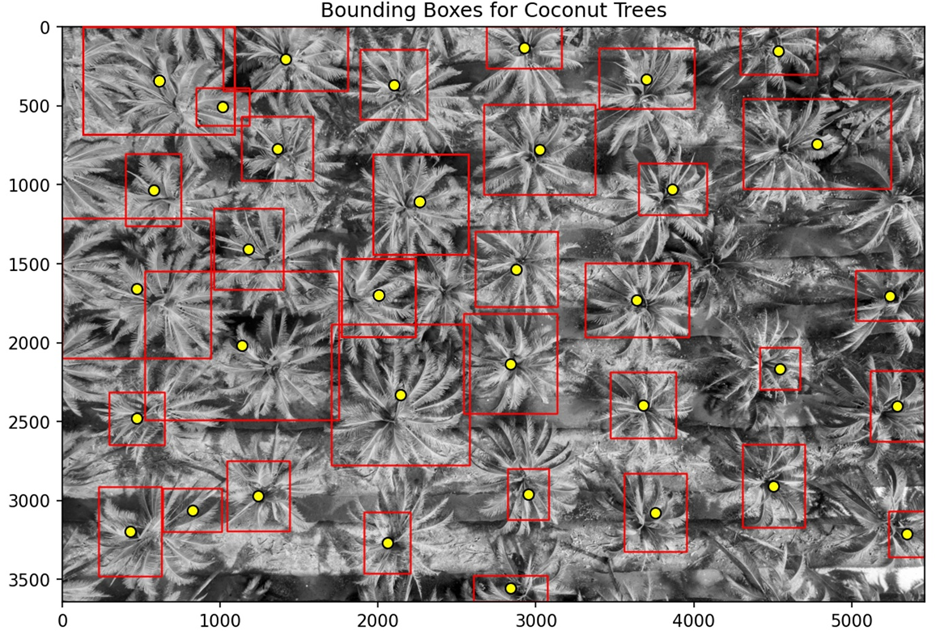

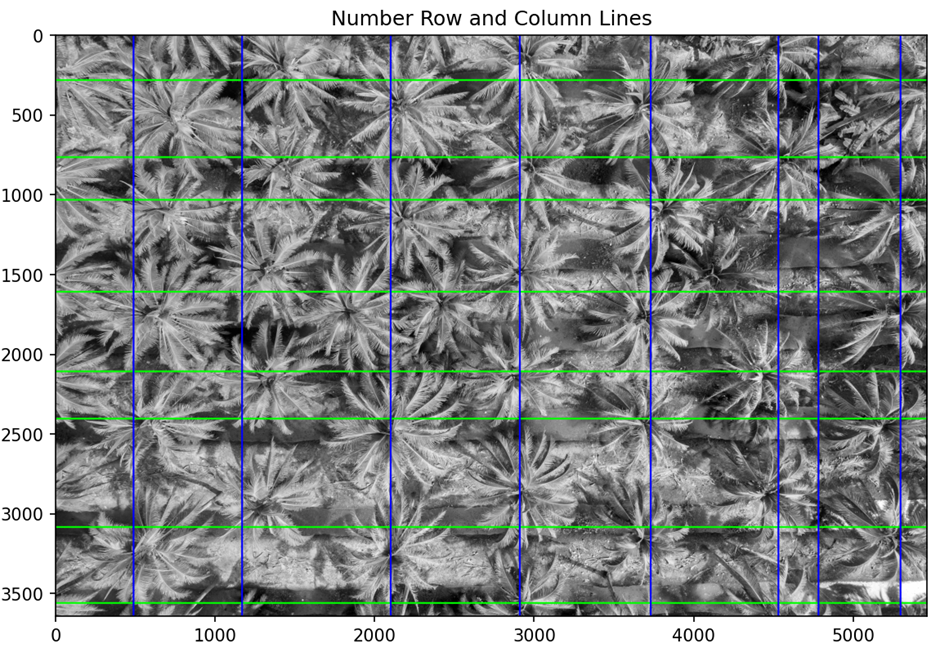

# Output 

***Without Morphing***:

Detected trees: 37, 
No. of detected rows: 8, 
No. of detected columns: 7

***With Morphological Operation (MORPH_CLOSE)***:

Detected trees: 35, 
No. of detected rows: 8, 
No. of detected columns: 8

# Reference

[1]	S. H. Al Mansoori, A. Kunhu, and H. Al Ahmad, “Automatic palm trees detection from multispectral UAV data using normalized difference vegetation index and circular Hough transform,” in High-Performance Computing in Geoscience and Remote Sensing VIII, B. Huang, S. López, and Z. Wu, Eds., Berlin, Germany: SPIE, Oct. 2018, p. 3. doi: 10.1117/12.2325732.

# Libraries Used

OpenCV

Numpy

Pandas

Matplotlib
